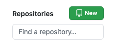
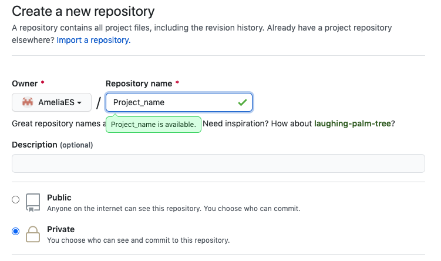
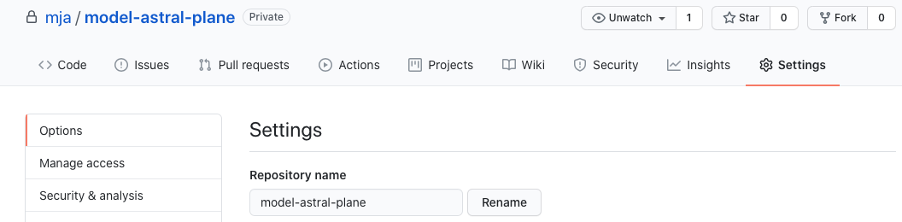
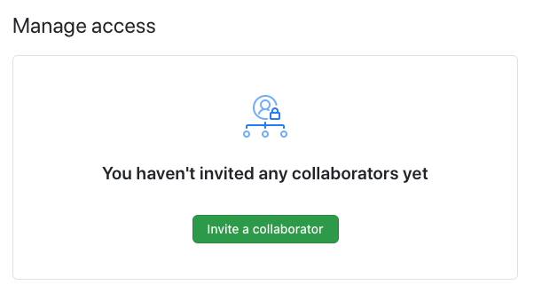
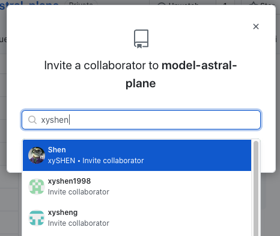
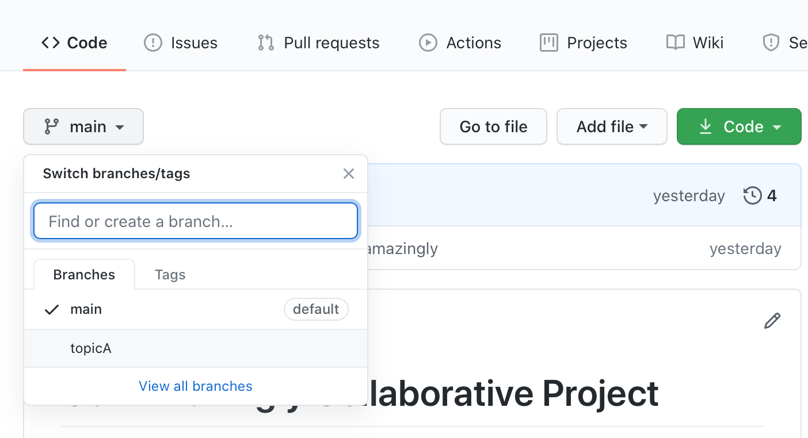
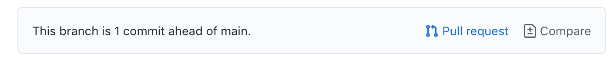

# KT Coding Club: Collaboration and Code Review


Collaboration is the essence and reason for using version control. In practice, collaboration in Git takes three main forms:

1. Collaborating with your past and future selves
2. Collaborating with yourself using different computers (e.g., laptop and cluster)
3. Collaborating with a colleague. 

Today we will focus on #3, but the skills you'll learn are also applicable to #1 and #2. We'll use a "buddy system" where you will collaborate with a coding partner, see what happens when you both try to commit changes to a file at the same time ("merge conflict"), and learn some effective ways to managing your work with a collaborator using git tools ("branches") and GitHub features ("pull requests").

We'll call our buddies "Buddy A" and "Buddy B".

## 1: Setting up a new repository

1. **Buddy A**: Create a new repository.
	
	
2. **Buddy A**: initialise the repository with a README or add it yourself. Clone the repository to your computer.
3. **Buddy A**: grant read/write access on the repository to **Buddy B**. 
 	- Go to *Settings* > *Manage Access* (you'll be prompted for your password)
    
    - Under *Manage Access* click the "Invite a collaborator" button
      
    - Enter Buddy B's **username** *(note that the field will suggest the names of all GitHub users)*
  	  
4. **Buddy B**: Accept the invitation
	- Go to the page for the repository and clone the repository to your computer.
  
## Sharing changes (automatic merging)

5. **Buddy A** Update the project title in the `README.md`.
	```
	# Our Collaborative Project
	``` 
6. **Buddy A** `add`, `commit`, and `push` your changes to GitHub
7. **Buddy B** `pull` Buddy's changes.
8. **Buddy B** Make a change to `README.md` and `push` it to Buddy A.

## Managing merge conflicts

By default git is usually pretty good about merging multiple commits that edit the same file. However, sometimes two commits will make changes to the same lines. In this case, git raises a [merge conflict](https://git-scm.com/book/en/v2/Git-Branching-Basic-Branching-and-Merging#_basic_merge_conflicts) and asks you to manually merge the two sets of changes.

9. **Buddy A** Change the title of the project
	```
	# Our Amazing Collorative Project
	```
10. **Buddy B** Change the title of the project
	```
	# Our Stupendous Collorative Project
	```
11. **Buddy A** `add`, `commit`, and `push` your changes.
12. **Buddy B** `pull` from the repository. **Question: what message do you get?**
	```
	✓model-astral-plane % git pull                    (main) model-astral-plane-b
	remote: Enumerating objects: 5, done.
	remote: Counting objects: 100% (5/5), done.
	remote: Total 3 (delta 0), reused 3 (delta 0), pack-reused 0
	Unpacking objects: 100% (3/3), 290 bytes | 96.00 KiB/s, done.
	From github.com:mja/model-astral-plane
	   09b05d4..671575c  main       -> origin/main
	Updating 09b05d4..671575c
	error: Your local changes to the following files would be overwritten by merge:
		README.md
	Please commit your changes or stash them before you merge.
	Aborting
	```
12. **Buddy B** `add` and `commit` your changes and then `pull` again. **What message do you get now?**
	```
	Auto-merging README.md
	CONFLICT (content): Merge conflict in README.md
	Automatic merge failed; fix conflicts and then commit the result.
	```
13. **Buddy B**: Examine the `README.md` file:
	```
	<<<<<<< HEAD
	# Our Stupendous Collaborative Project
	=======
	# Our Amazing Collaborative Project
	>>>>>>> 671575c4068892ac2fb5e291737977c88c35b337
	```
	The first section starting with `<<<<<<< HEAD` shows the content in Buddy B's most recent commit ("`HEAD`"). The conflicting commit contents starts on the `=======` line and finishes with `>>>>>>>` followed by the commit hash.
14. **Buddy B**: Edit the `README.md` merge conflict section to reconcile the two sets of changes:
	```
	# Our Amazingly Stupendous Collorative Project
	```
	`add`, `commit`, and `push` the changes to Buddy A.


## Branching

A branch is a way to make changes to a bunch of files without interfering with the primary version of each file. When you create a new repository, Git creates a default branch for you, called `main` (on older versions of Git and GitHub the default branch was called `master` so you may see this in some documentation and in repositories that have been around for a while). The branch also keeps all of the changes you've made grouped together so that you can either merge them with the `main` branch all at once or discard them.

`git branch` will list the branches in the local repository. The branch you are currently in is highlighted with a `*`

15. **Buddy A and B**: use `git branch` to list the current branches

The command to create a new branch is `git branch BRANCH_NAME` where `BRANCH_NAME` should be a short, meaningful name to refer to the changes you want to work on.

16. **Buddy A**: create a branch called `topicA`.
17. **Buddy B**: create a branch called `topicB`.
18. **Buddy A and B**: run `git branch` again on its own. **What branch are you on?**

To switch between branches, use `git checkout BRANCH_NAME`.

19. **Buddy A** Switch to your new branch with `git checkout topicA`.
20. **Buddy B** Switch to your new branch with `git checkout topicB`.
21. **Buddy A and B**: Run `git branch` again to confirm what branch you are on.
22. **Buddy A and  B**: Make an edit to your `README.md` file and commit your change.
23. **Buddy A and B**: Switch back to the `main` branch. **What happens to the README file?**
24. **Buddy A and B**: Switch back to your topic branch and make a few more edits to the README or add additional files. Commit your changes.

## Sharing branches

Pushing can also be used to copy all the changes in branch over to GitHub `git push origin BRANCH_NAME` to push `BRANCH_NAME` to GitHub. 

25. **Buddy A**: Push your branch to GitHub: `git push origin topicA`
26. **Buddy B**: Push your branch to GitHub: `git push origin topicB`
27. **Buddy A and B**: Pull the most recent updates from GitHub and examine your Buddy's branch.

## Merging branches

Branches can be merged together using the `git merge` command. `git merge BRANCH_NAME` will merge the named branch  `BRANCH_NAME` into the currently active branch.

28. **Buddy A**: Switch back to the `main` branch then merge your changes from the `topicA` branch: `git checkout main; git merge topicA`
29. **Buddy B**: Switch to your `topicB` branch and merge the changes from `topicA`: `git checkout topicB; git merge topicB`
30. **Buddy A and B**: Push your changes up to GitHub

## Pull requests

Pull requests are a project management feature in GitHub for coordinating the merging of commits and branches together.

31. **Buddy B**: Go to the GitHub repository and switch to `topicB`
	
	From the branch page, click on the "Pull request" button
	
32. **Buddy B**: Fill out the Pull request form and select **Buddy A** to review it.
33. **Buddy A**: Accept **Buddy B**'s pull request.
