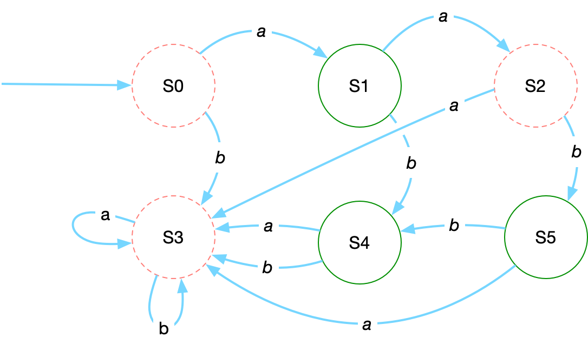
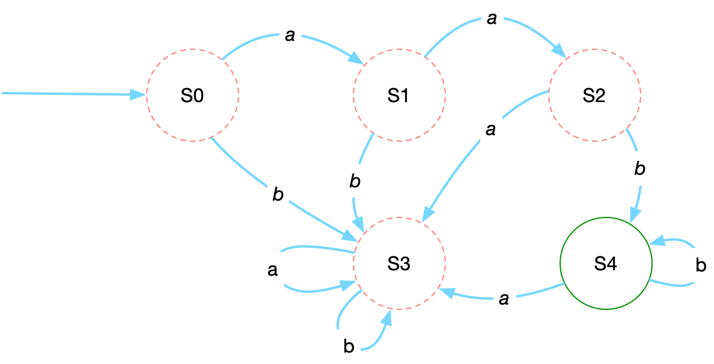

# Regular languages

A foundational question in computer science is: What kinds of problems are machines able to solve? One of the most basic types of machines ("automata") are ones with a limited amount of memory, called [finite state machines](https://en.wikipedia.org/wiki/Finite-state_machine). The types of problems that finite state machines can solve can be re-expressed as the following: given a formal set of rules definiting a language, a finite amount of memory, and an input sequence, decide whether the input sequence is part of the specified language. 

Here, a "language" is an abstract formalism for sequences of symbols (strings) composed from a specified alphabet. For example, we could define a language (let's call it "Language 1") using the alphabet *Σ = {a,b}* and consists of the strings *a*, *ab*, *aab*, and *aabb*. The following machine will accept or reject strings for Language 1:



The machines has six states (`S0-S5`). It starts in state `S0` and then changes state based on the next symbol (`a` or `b`) that it sees. If the machine finishes reading the sequence and is in one in one of "accept" states (drawn with a solid green line; `S1`, `S4`, or `S5`), then the input sequence is part of the language. If the machines finishes in a reject state (drawn in red dotted lines; `S0`, `S2`, or `S3`), then the input sequence is not part of the language. 

Languages that can be encoded in such finite state machines are called "**regular**".

Language 1 has four sequences in it (*a*, *ab*, *aab*, and *aabb*), but regular languages can also be defined by infinitely long sequences yet still be encoded into a machine with finite memory. What about a language ("Language 2") consisting of all sequences that start with `aa` followed by one more more `b`s? Such a machine would look like:



Again, the machine starts in state `S0`. If it sees the sequence `aa` it will be in state `S2`. If the next symbol is a `b`, it switches to state `S4`. As long as all the remaining symbols in the sequence are `b`, the machine will keep looping back to the accept state `S4`. 

The first machine we defined could be specified by writing out the four sequences it accepts. However, the second machine has an infinite set of sequences it can accept. How do we encode these in compact form without enumerating all of them, or without having to think explicitely in terms of defining a finite state machine? The answer is by writing a "**regular expression**" (or "regex").

A regular expression is string that encodes all the sequences that are part of a given regular language. A regular expression for Langauge 1 is `a{1,2}b{0,2}`. Breaking this down:

- `a`: Most characters in regular expressions are literals, so this means means the first character in the string must be `a`.
- `{1,2}` and `{0,2}`: the numbers in brackets like `{n,m}` means the preceeding symbols must appear between `n` and `m` times, so `a{1,2}` means "one or two `a`s" while `b{0,2}` means "zero, one, or two `b`s".

A regular expression for Langauge 2 is `aab+` or `a{2}b+`:

- `aa` means the sequence must start with literal "aa" (or we could express this pattern as `a{2}`)
- `b+` means "one or more `b`s"

This expressivity means that regular expression are really good for pattern matching (does a sequence for part of a sequence match a given pattern?). Regular expressions can be used find sequences in character data.


# Regular expressions in R

Regular expressions in R are supported by both built-in functions (`grep`, `grepl`, `gsub`, `strsplit`) as well as by functions in the [`stringr` library](https://stringr.tidyverse.org/articles/regular-expressions.html). In most functions that accept a regular expression, the argument for the regex will be called `pattern`. 

## Regex engines

There are a few different syntaxes for regular expressions in R. The built-in functions by default use the [POSIX](https://www.boost.org/doc/libs/1_64_0/libs/regex/doc/html/boost_regex/syntax/basic_extended.html) syntax but also have an option to use [PERL](https://perldoc.perl.org/perlre)-like syntax. The functions in the `stringr` library use [ICU](https://unicode-org.github.io/icu/userguide/strings/regexp.html) syntax. The basic syntax of all these libraries is similar and only diverges for more advanced features. For the examples here we will use the `stringr` version. 

You can get an overview of the built in regex syntax using with the `?regex` help command. For `stringr`, the regex help is `?stringi::about_search_regex`.

## `stringr` recap

Using functions from the `stringr` library

```{r stringr}
library(stringr)
```

As an example we will match ICD10 and Read2 diagnostic codes

```{r diagnoses}
diagnoses <- c("F410", "F322", "I119", "E112", "F33", "F200", "Eu32000", "Eu32400", "Eu33200", "Eu20000", "Eu20311")
```

We will focus on two `stringr` functions:

- `str_subset(string, pattern)`: returns elements of the vector `string` that match `pattern`
- `str_match(string, pattern)`: returns the parts of each element of the vector `string` that match `pattern`. When there is no match returns `NA` for an element.

For example, if we want to find ICD diagnoses that for mental health (chapter "F"), we can return elements of `diagnoses` that match the literal `"F"` with

```{r subset}
str_subset(diagnoses, "F")
```

or we can return the portions that match `"F"` with

```{r match}
str_match(diagnoses, "F")
```

Note, these functions will match `pattern` no matter where it appears in the string:

```{r pos}
str_subset(c("F123", "123F", "X123", "123X"), "F")
```

## Match any character

A single `.` (period) will match any character in a string. For example, to match any single character followed by two `1`s followed by any character:

```{r period}
str_subset(diagnoses, ".11.")
```

## Repetition

On its own a character literal or `.` will match a single character. More than one character can be matched using repetition sequences:

- `?`: match the preceeding pattern zero or one times.
- `*`: match the preceeding pattern zero or more times.
- `+`: match the preceeding pattern one or more times.
- `{n}`: match the preceeding pattern exactly _n_ times.
- `{n,}`: match the preceeding pattern _n_ or more times.
- `{n,m}`: match the preceeding pattern between _n_ and _m_ times

Match `3` zero or one times:
```{r}
str_subset(diagnoses, "3?")
```

Match `3` zero or more times:
```{r}
str_subset(diagnoses, "3*")
```

Match `3` one or more times:
```{r}
str_subset(diagnoses, "3+")
```

Match `3` once:
```{r}
str_subset(diagnoses, "3{1}")
```
Note how the matching is greedy: `Eu33200"` matches `"3{1}"` even though it has two `3`s in it because the match is satisifed when the first `3` is encountered in the string.

Match exactly two `3`s
```{r}
str_subset(diagnoses, "3{2}")
```

## Character classes

In addition to literal characters, regular expressions can also match classes of characters such as letters, numbers, whitespace, or punctuation. Character classes are specified in three ways: escaped meta-characters, characters lists, and named classes

### Escaped meta-characters

These character classes are specified by a `\` (backslash) followed by a single upper or lowercase character. Lowercase meta-characters usually specify a specific kind of character to match while uppercase meta-characters usually specify "anything but" certain type of chaaracter

- `\d`: a number or digit
- `\D`: anything that is not a number or digit
- `\s`: whitespace character
- `\S`: non-whitespace character
- `\w`: word character (any letter or number)
- `\W`: non-word character

Because `\` has a special meaning in strings, when used in a regular expression it needs to be escaped with a `\` preceeding it, e.g., `"\\d"` to match a digit

Match 5 digits:
```{r}
str_subset(diagnoses, "\\d{5}")
```

### Character lists

A list of characters can be matched by enclosing them in `[]` (square brackets). 

To match the literals "F" or "I":
```{r}
str_subset(diagnoses, "[FI]")
```

The order does not matter:
```{r}
str_subset(diagnoses, "[IF]")
```

Match "F" followed by a "3" or "4"

```{r}
str_subset(diagnoses, "F[34]")
```

Ranges of letters and numbers can also be matched within a block using `-` (hyphen).

Match an uppercase letter (A-Z) followed by a digit:
```{r}
str_subset(diagnoses, "[A-Z]\\d")
```

Match an uppercase letter (A-Z) followed by a lowecase character (a-z):
```{r}
str_subset(diagnoses, "[A-Z][a-z]")
```

Character lists can be inverted (match anything not listed) by placing `^` (caret) as the first character. 

Match "F" followed by anything except "3" or "4"

```{r}
str_subset(diagnoses, "F[^34]")
```

### Named character classes

Special groups of characters in a list can also be specified by name, which are formatted with `[:NAME:]` (a name surrouned by `:` (colons) and enclosed in square brackets:

- `[:alnum:]`: alphanumeric characters (letters and numbers)
- `[:alpha:]`: alphabetic characters
- `[:blank:]`: tab and space
- `[:digit:]`: number/digit (0-9)
- `[:graph:]`: letters, numbers, and punctuation ("graphical characters")
- `[:lower:]`: lowercase letters
- `[:punct:]`: punctuation characters
- `[:space:]`: space, tab, and newline
- `[:upper:]`: uppercase letters

Match an two or more letters:
```{r}
str_subset(diagnoses, "[[:alpha:]]{2,}")
```

Match an uppercase letter (A-Z) followed by a lowecase character (a-z):
```{r}
str_subset(diagnoses, "[[:upper:]][[:lower:]]")
```

## Anchors

By default regular expressions will match any part of the string. The boundary of the regular expression can be "pinned" to the start or end of the string using anchors: `^` (caret) matches the beginning of a string (or line) and `$` matches the end of a string (or line)

Match a letter at the beginning of a string:
```{r}
str_subset(c("F123", "123F", "X123", "123X"), "^[[:alpha:]]")
```

Match a letter at the end of a string:
```{r}
str_subset(c("F123", "123F", "X123", "123X"), "[[:alpha:]]$")
```

Match diagnoses that start with a single character followed by 2 or 3 numbers
```{r}
str_subset(diagnoses, "^[[:alpha:]][[:digit:]]{2,3}$")
```

## Groups and capturing

Parts of a string can be matched and extracted by grouping with `()` (parentheses). When used with `str_match()`, each capture group will be returned as a column.

Match and capture a single uppercase letter at the start of a string, followed by two numbers and then zero or one numbers
```{r}
str_match(diagnoses, "^([[:upper:]])([[:digit:]]{2})([[:digit:]]?)")
```

Match and capture an uppercase followed by a lowercase letter at the start of a string, followed by one or more numbers
```{r}
str_match(diagnoses, "^([[:upper:]][[:lower:]])([[:digit:]]+)")
```


